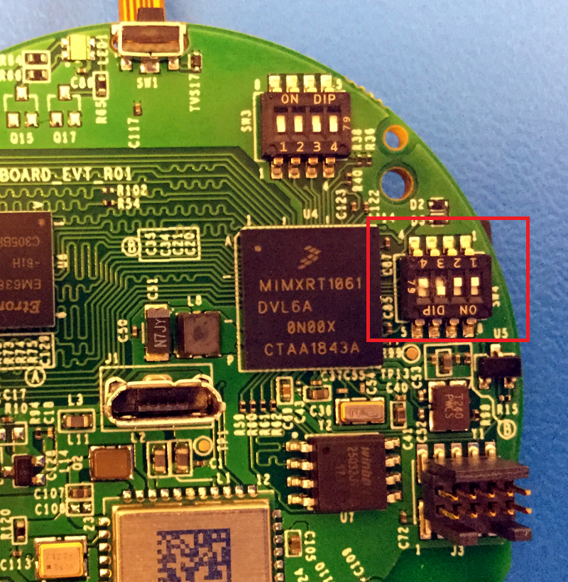
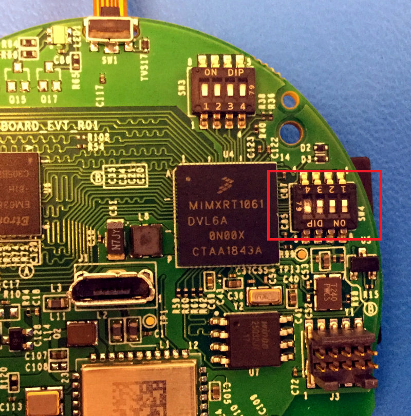
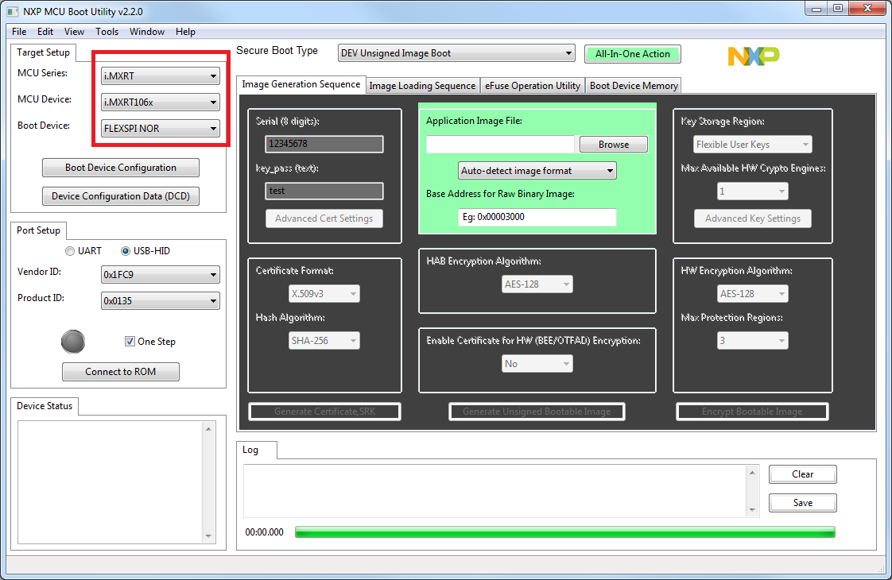
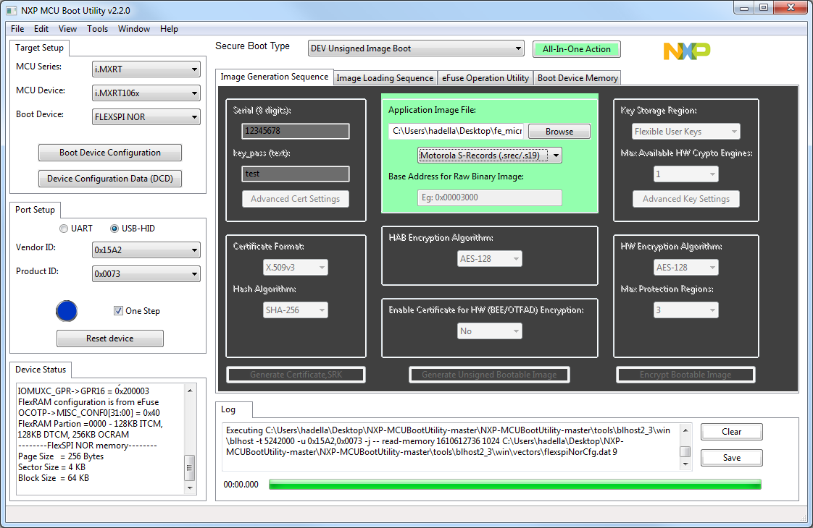
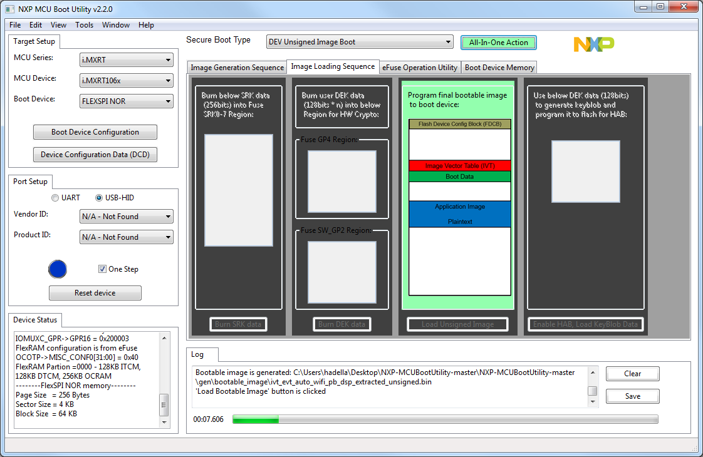
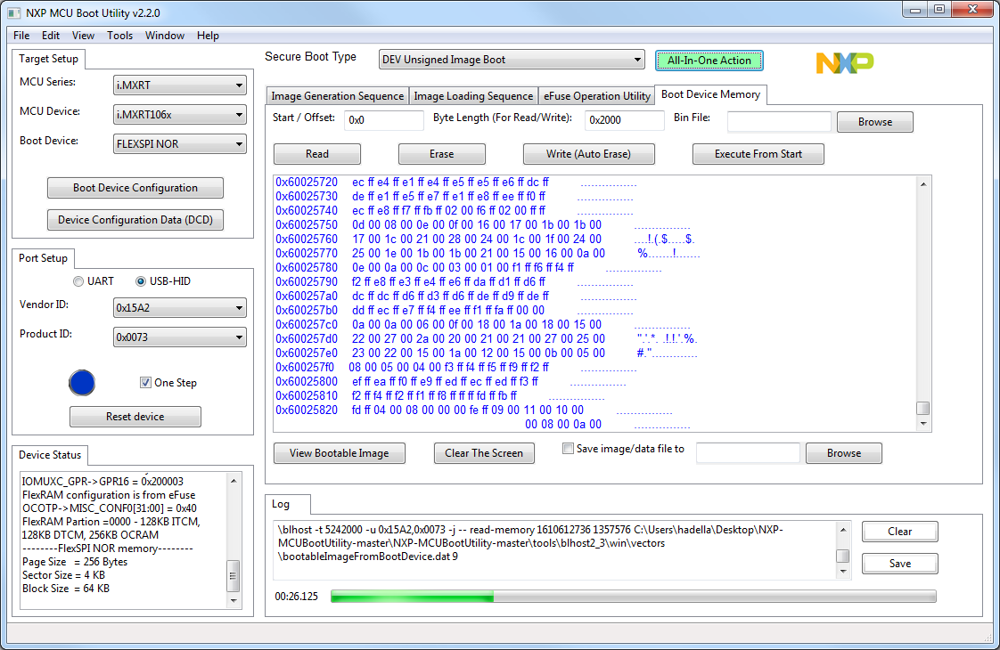

# Insecure Firmware Update Guide

This is a guide on how to manually update the firmware on a HeMP2 device 
using the NXP-MCUBootUtility tool.

This tool can be downloaded from the url:  
https://github.com/JayHeng/NXP-MCUBootUtility

## Step 1: Set the boot pins

Before we can use the tool, we need to set the boot pins on the HeMP2 itself.
When using the NXP-MCUBootUtility, set the SW4 pins to match the image on the
left.

Once the firmware has been updated, set the SW4 pins to match the image on the
right.

|Update Firmware Settings|Normal Settings|
|-|-|
|||

Once the boot pins are set, plug in the USB cable to power the HeMP2. When
the boot pins are set in the firmware update mode, the RGB LED will look like
a feint violet color.
 
## Step 2: Start NXP-MCUBootUtility

When you start the NXP-MCUBootUtility for the first time, you'll need to make
sure to select the correct NPX device. This will populate the vendor and product
ID values in the 'Port Setup' area.

When the program starts, there will also be a text console window open. It will
not have any content initially.

Next, click the 'Connect to ROM' button. This may take a few seconds, but there
will a flurry of activity in the text window, and eventually, the main window
will change.

## Step 3: Update the Firmware

In the green box, click the 'Browse' button and select the `.s19` firmware file
you wish to update. Since the firmware files are `.s19` files, choose the option
for 'Motorola S-Records (.srec/.s19)'.

Next, click the 'All-In-One Action' button just above. The main window will then
change a few times.

After a few seconds, the window will change again and update as the firmware is
flashed on to the HeMP2 device.

Depending on the size of the firmware file, it can take a while to finish. Once
the update is done, the program will play a sound. The progress bar will also be
completely full.

## Step 4: Reset the Boot Pins

Close the program and then unplug the USB cable from the HeMP2.

Next, reset the boot pins for normal operation, then plug the USB in again. The
HeMP2 should then boot normally and execute whatever firmware which was 
updated.
