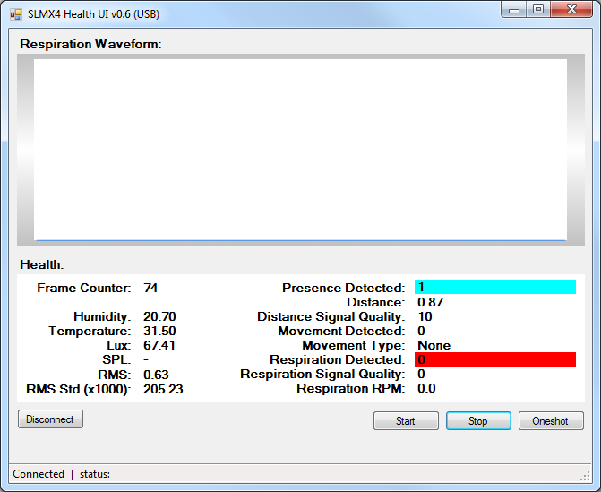
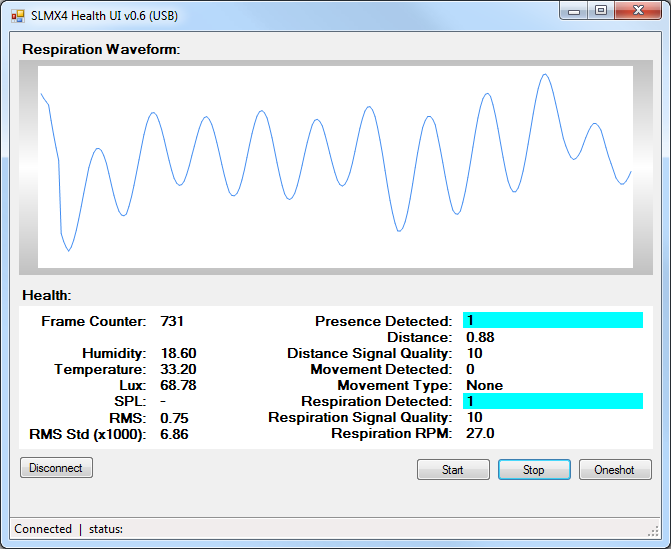

# SLMX4 - Health App User Guide

[Back](readme.md)

The following guide provides information about downloading and running the SLMX4 Health App. To update to the SLMX4 Health Firmware, please see the [Updating the SLMX4 Firmware Guide](insecure_fw_update.md).

## SLMX4 Health App - Download and Connect
### Download the SLMX4 Health App
1. Download the [SLMX4 Health App](https://modules-release.s3-us-west-2.amazonaws.com/health_windows_app/slmx4_health_ui_usb.zip)
2. Extract the files from the `slmx4_health_ui_usb` Zip Folder.
3. Move the `slmx4_health_ui_usb` Folder, if desired. This folder location will be know as [SLI-Modules].
#### SLMX4  Buddy Files
    └── [SLI-Modules]\slmx4_health_ui_usb\
        ├── slmx4_health_ui_usb.exe
        ├── LibUsbDotNet.dll
        └── protobuf-net.dll

### Power Up the SLMX4 and Verify the USB COM Port
1. Connect a Micro-USB Cable to your PC and to the SLMX4 USB Port
2. Once powered, with the Red LED will blink at a steady 1 Hz rate, open the `Device Manager` by searching Windows
3. Under the `Ports (COM & LPT)`, verify there is a new USB Device
    - For example `USB Serial Device (COM8`)

### Launch the SLMX4 Health App and Connect the SLMX4
1. Launch the SLMX4 Health App by running
    - `[SLI-Modules]\SLMX42_Buddy\slmx4_health_ui_usb.exe`
    - Windows will most likely launch a `Protect Your PC` Window, if so
        1. Click `More Info`
        2. Click `Run anyway` in the bottom left
2. Click the `Connect Button` in the bottom left. The device will be connected when the `Connect` Button changes to `Disconnect`
3. Once connected, click `One Shot` in the bottom right. If this is successful, the Frame Counter will update to `1`.

## SLMX4 Health App - Usage
### The One Shot
The `Oneshot` button is really only useful for testing. The health monitoring software requires a number of radar signals in order to compute presence and respiration.

### Health Monitoring
The Health Firmware will begin running when the `Start` Button is clicked. In addition to the blinking Red LED (Module Heartbeat), there is also an RGB LED which indicates presence on the device. It will be Red for no presence, and Cyan for presence. There is a corresponding box in the app which also indicates presence.

#### Presence Detected
In this example, the device was placed on a desk with the antennas facing the user. Once started, after a few seconds, the presence is detected.
<p align="center">
  
</p>

#### Respiration
Initially, the plot area will be empty. After a few seconds, the respiration waveform will begin to display with the newest data at the right and the oldest data being cycled out the left. The figure below shows the respiration waveform after a while. There is also a Cyan colored indication which activates in the app; there is no corresponding indication on the device itself.
<p align="center">
  
</p>

If there is fast movement for more than 4 seconds, the respiration waveform will reset. The respiration will not be calculated again until the buffer completely fills up. The figure below shows a situation where there had been a reset and the buffer is nearly full again.  
<p align="center">
  
</p>

### Save CSV
There is a checkbox next to the 'Start' button. When this is checked, data in CSV format will be saved to the `data` folder until the control is unchecked again.

Example:
```
PresenceDeteced,RespirationDetected,MovementDetected,MovementType,Distance,DistanceConf,RespirationRpm,RespirationConf,Rms,RmsStd,Humidity,Temperature,Lux,SPL,UTC Time(-7)
1,0,0,0,0.76,100,24.6,59,0.8012381,0.0237974815368652,16.90,31.40,62.31,,09:47:48.1
1,0,0,0,0.76,100,24.6,60,0.7973012,0.0240422878265381,17.00,31.30,62.31,,09:47:48.2
1,1,0,0,0.76,100,24.6,61,0.796906,0.0242731819152832,16.90,31.40,62.31,,09:47:48.3
1,1,0,0,0.76,100,24.6,62,0.7962412,0.0244450187683105,17.00,31.40,62.31,,09:47:48.4
1,1,0,0,0.74,100,24.6,63,0.7921052,0.0245459403991699,17.00,31.40,62.31,,09:47:48.5
1,1,0,0,0.73,100,24.6,64,0.7969559,0.0244412670135498,17.10,31.40,62.31,,09:47:48.6
```
