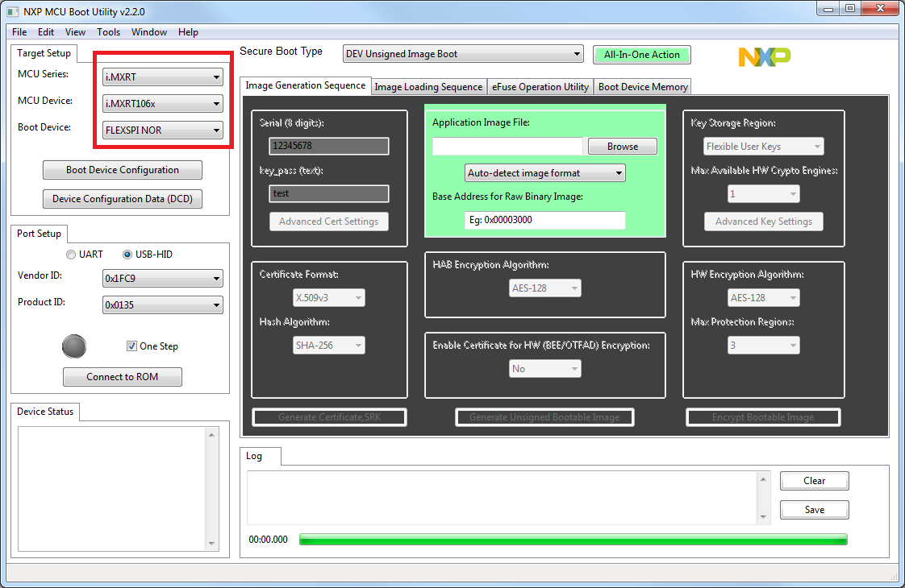

# Insecure Firmware Update Guide

[Back](readme.md)

This is a guide on how to manually update the firmware on a SLMX4-Base using the NXP-MCUBootUtility tool.

## Downloads
- [NXP-MCUBootUtility Tool](https://github.com/JayHeng/NXP-MCUBootUtility/releases): Instructions using this tool shown below
- [MCUXpresso Secure Provisioning Tool](https://www.dropbox.com/sh/625jy4ovpvaticd/AAAo25quFGzx2itQyhBfPT63a?dl=0): Alternate method to update SLMX4 firmware

## Using the NXP-MCUBootUtility Tool

### Step 1: Set the boot pins

Before we can use the tool, we need to set the boot pins on the SLMX4-Base itself.
When using the NXP-MCUBootUtility, set the SW4 pins to match the image on the
left.

Once the firmware has been updated, set the SW4 pins to match the image on the
right.

|Update Firmware Settings|Normal Settings|
|-|-|
|||

Once the boot pins are set, plug in the USB cable to power the SLMX4-Base. When
the boot pins are set in the firmware update mode, the RGB LED will look like
a faint violet color.
 
### Step 2: Start NXP-MCUBootUtility

When you start the NXP-MCUBootUtility for the first time, you'll need to make
sure to select the correct NPX device. This will populate the vendor and product
ID values in the 'Port Setup' area.

When the program starts, there will also be a text console window open. It will
not have any content initially.

  

Next, click the 'Connect to ROM' button. This may take a few seconds, but there
will a flurry of activity in the text window, and eventually, the main window
will change.

  

### Step 3: Update the Firmware

In the green box, click the 'Browse' button and select the `.s19` firmware file
you wish to update. Since the firmware files are `.s19` files, choose the option
for 'Motorola S-Records (.srec/.s19)'.

  

Next, click the 'All-In-One Action' button just above. The main window will then
change a few times.

  

After a few seconds, the window will change again and update as the firmware is
flashed on to the SLMX4-Base.

  

Depending on the size of the firmware file, it can take a while to finish. Once
the update is done, the program will play a sound. The progress bar will also be
completely full.

### Step 4: Reset the Boot Pins

Close the program and then unplug the USB cable from the SLMX4-Base.

Next, reset the boot pins for normal operation, then plug the USB in again. The
SLMX4-Base should then boot normally and execute whatever firmware which was 
updated.

## Using the MCUXpresso Secure Provisioning Tool

### Step One: Download and Unzip Software

Select this link:
- [MCUXpresso Secure Provisioning Tool](https://www.dropbox.com/sh/625jy4ovpvaticd/AAAo25quFGzx2itQyhBfPT63a?dl=0)

Check all three boxes and select download

  

Next, extract the files

  

### Step Two: Install the Software

Open the newly extracted file and click on the "MCUXpresso_Secure_Provisioning_v3.1.exe" file

  

Close the installer and launch the MCUXpresso Secure Provisioning v3.1 software

  

### Step Three: Software Setup

The first time you run the provisioning tool, you will be greeted with this window:

  

The current SLMX4 uses the MIMXRT106S and so you will make this selection:

  

Click "Create" and this window will appear:

  

### Step Four: Set the boot pins

Before we can use the tool, we need to set the boot pins on the SLMX4-Base itself.
When using the MCUXpresso Secure Provisioning Tool, set the SW4 pins to match the image on the
left.

Once the firmware has been updated, set the SW4 pins to match the image on the
right.

|Update Firmware Settings|Normal Settings|
|-|-|
|||

Once the boot pins are set, plug in the USB cable to power the SLMX4-Base. When
the boot pins are set in the firmware update mode, the RGB, green and red leds will be on and static.

  

### Step Five: Flash the SLMX4 with the Firmware

Next, we will select an image to flash onto the SLMX4. Select "Browse..." next to the "Source executable image:" and select the .s19 file you wish to flash.
If you "Configuration Helper" pop-up, click on "Deselect All" and click "OK".

  

Next, for the "DCD (binary)" option, select "From Source Image" from the dropdown menu. Select "Build Image"

  

This window will appear. Ensure that the build was successful. You may close this mini window and click on the "Write image" tab

  

From here, select "Write Image" and wait for the process to complete.

  

Ensure that the process is successful. You may close this mini window. The SLMX4 is now flashed with your selected firmware.

  

