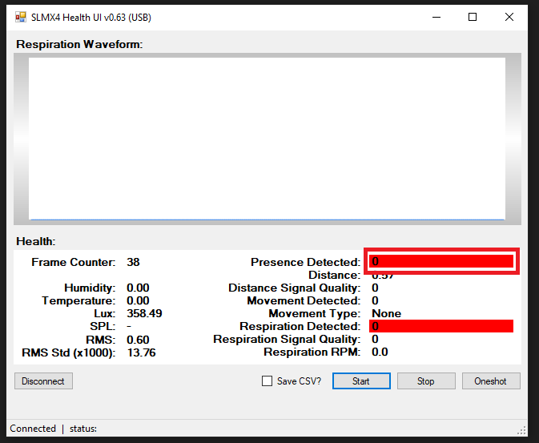

# Initial Unboxing and Setup Guide

## Unpacking and Powering On
When you first receive your SLMX4, carefully remove it from the EDS packaging.
Ensure the switch at the back is in this configuration:

  

WARNING: DO NOT CHANGE THIS CONFIGURATION WHILE THE MODULE IS POWERED ON
  
Plug in the SLMX4 using a micro-usb cable. The RGB LED will be a greenish-yellow color as shown:

  

## The color of the LEDs
The health module comes equipped with an RGB LED as well as one green and one red LED.
The color of the RGB LED can help determine which firmware is present on the module.
In this case, the greenish-yellow indicates that the module has the MATLAB firmware.
If the module instead had the health firmware for the Health App, the RGB light would be off while the red led flashes at a 1 Hz rate when initially powered up.

  

If the switch on the back was in the following configuration:

  

This would indicate that the module is ready to be flashed via the USB. Note that the module will not work with the MATLAB Server or Health app regardless of the firmware loaded while in this configuration.
In this configuration, the module RGB LED will be teal while the red and green leds will be on and static as shown:

  

If the health firmware is flashed onto the SLMX4, there are a few different RGB led characteristics that take place when taking measurements with the control of Health App.
NOTE: Instructions to flash firmware onto the module will be detailed later in this document.

When using the Health App with the module connected via USB, if the start button is pressed then the RGB LED will turn green while the module takes measurements.

  

NOTE: The "Presence Detected" is 0.

  

Once the "Presence Detected" value changes to a non-zero value, the RGB led will change color.

  

  

## Check Device Manager for Auto Load Driver

With the SLMX4 plugged into your PC, click on the start menu and search for "device manager" and open it. Browse to "Ports (COM $ LPT)" and expand the menu. Ensure that the SLMX4 appears as "Virtual Com Port (COMX)" where "X" denotes the specific COM port for your machine.

  

If your module does not show up in the device manager in this manner, click [HERE](https://github.com/SensorLogicInc/modules/tree/main/usb_driver) and follow the instructions to manually install the correct driver.

## Flashing Firmware

The SLMX4 will come pre-loaded with the MATLAB firmware. To switch to the MATLAB or Health App firmware, refer to the [SLMX4 Firmware Update](insecure_fw_update.md) user guide.

These are the latest files for both the Health App and MATLAB firmware:

- [SLMX4-Base Health Firmware](https://modules-release.s3-us-west-2.amazonaws.com/firmware/slmx4_base_usb_vcom_pb_dsp-epam0P1.s19)
- [SLMX4-Base MATLAB Firmware](https://modules-release.s3-us-west-2.amazonaws.com/firmware/slmx4_base_usb_vcom_xep_matlab_server.s19)
 
Here is the user guide for using the Health App. 

- [SLMX4 Health App](health_app.md)

Here is the latest version of the Health App. Refer to the SLMX4 Health App user guide above to get started.

- [SLMX4 Health App](https://modules-release.s3-us-west-2.amazonaws.com/health_windows_app/slmx4_health_ui_usb.zip)