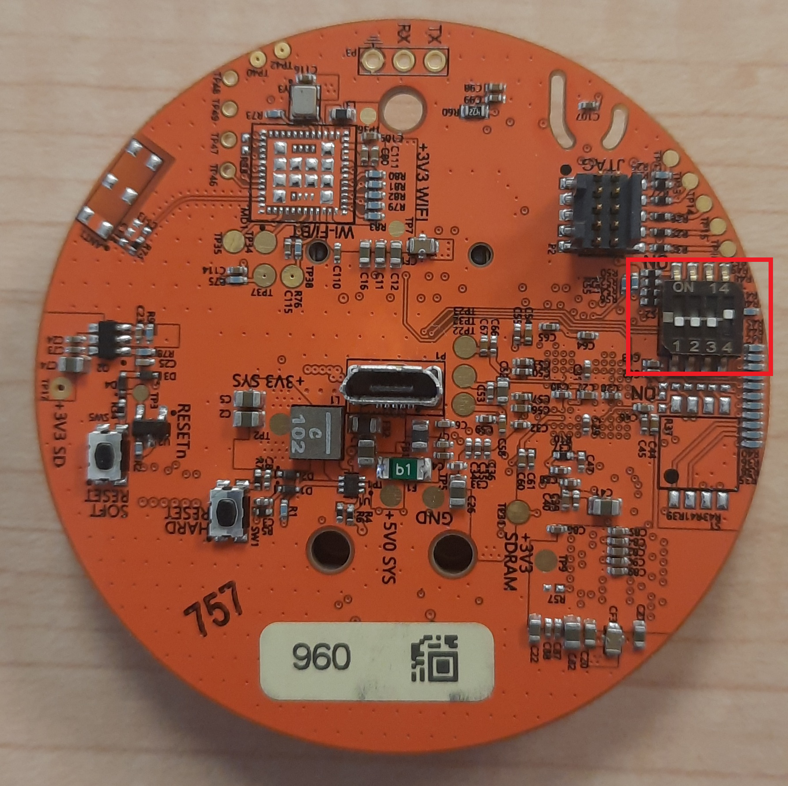
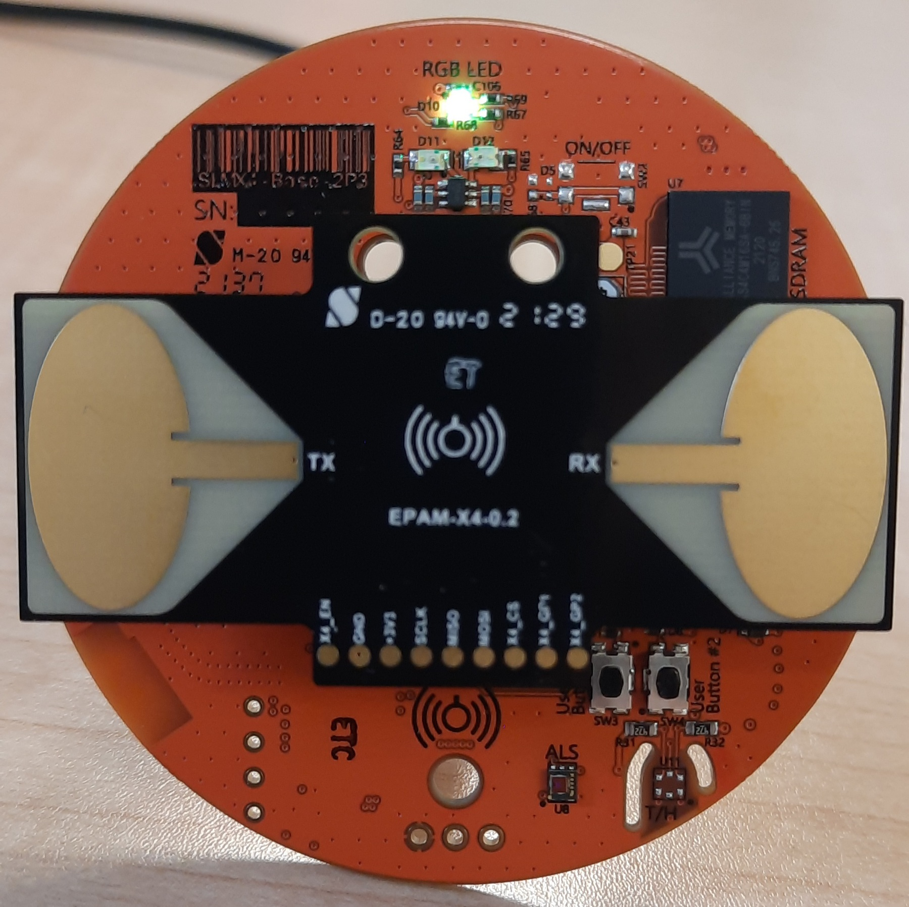
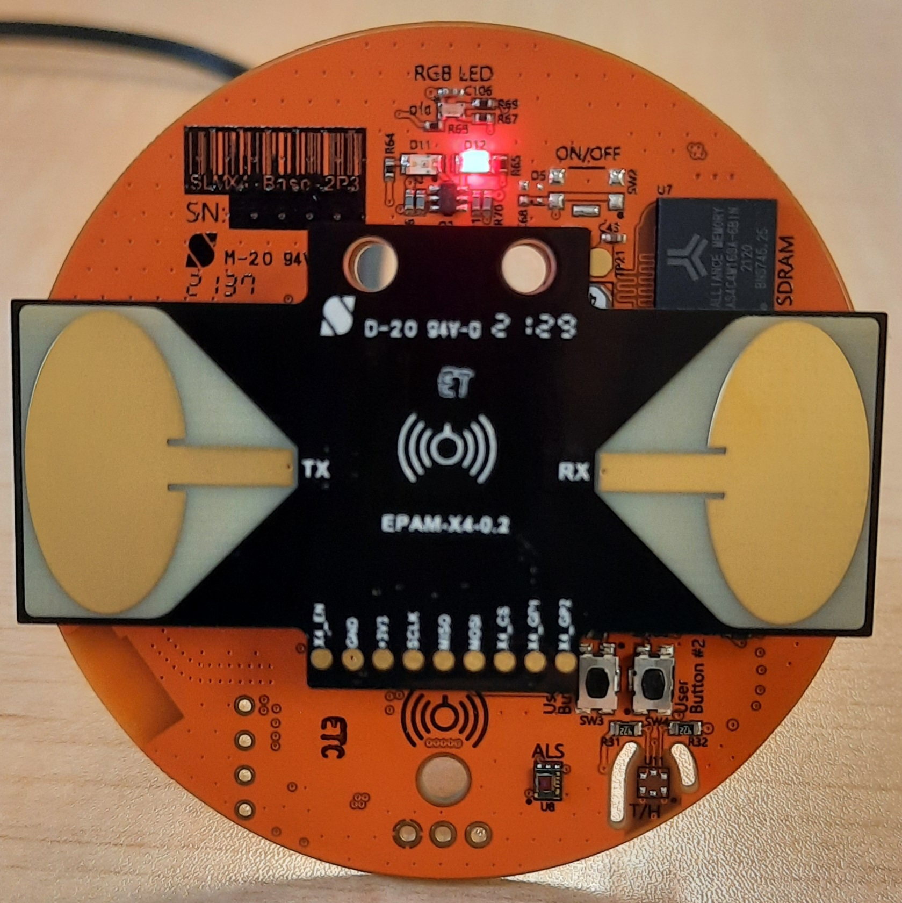
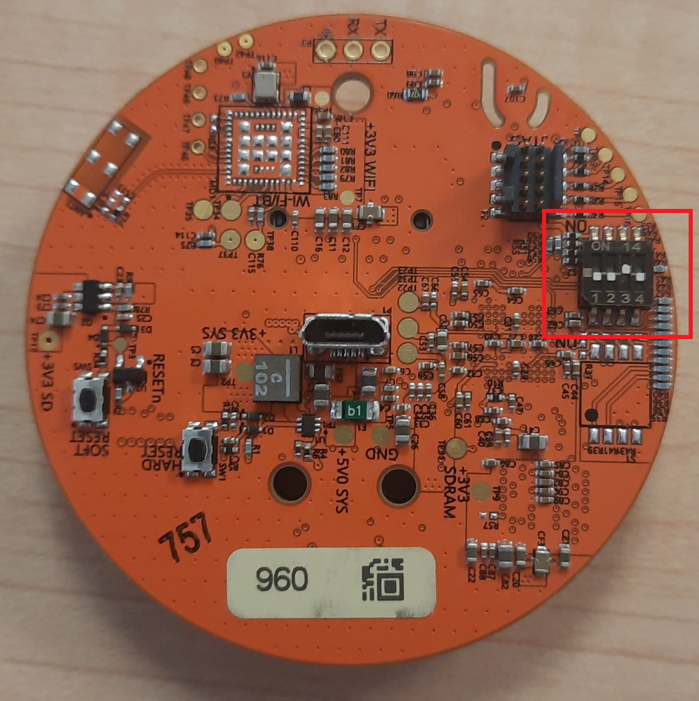
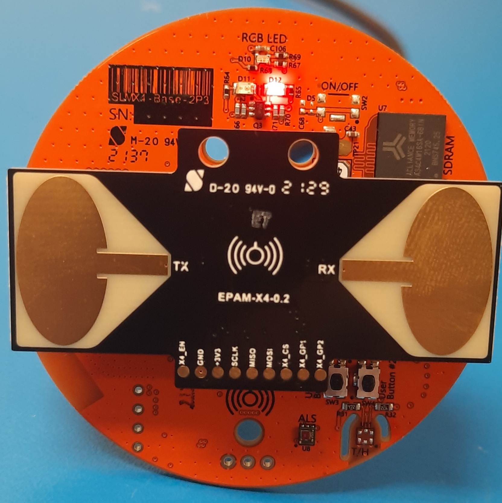
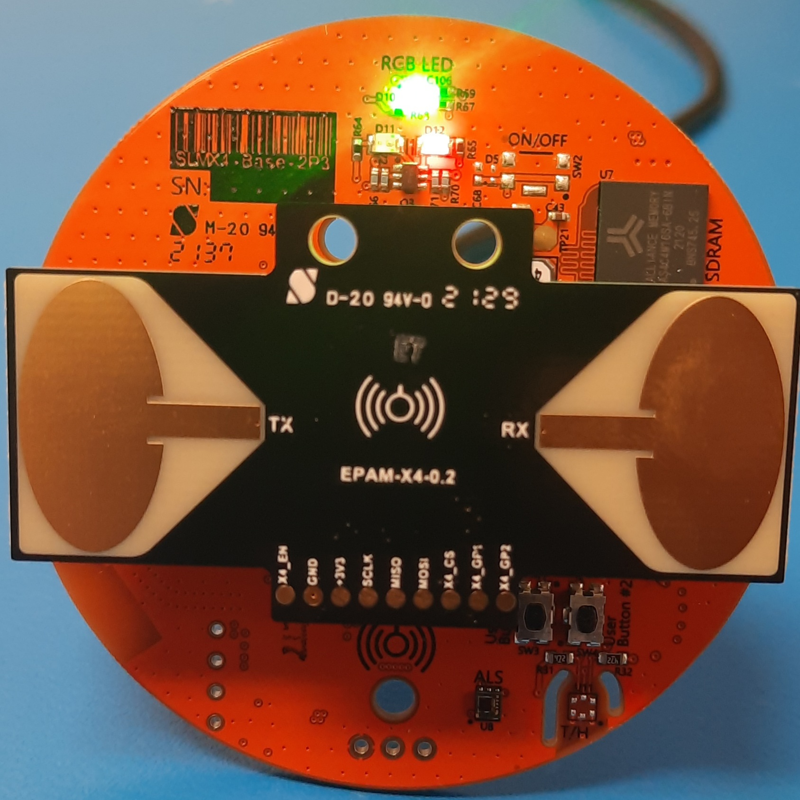
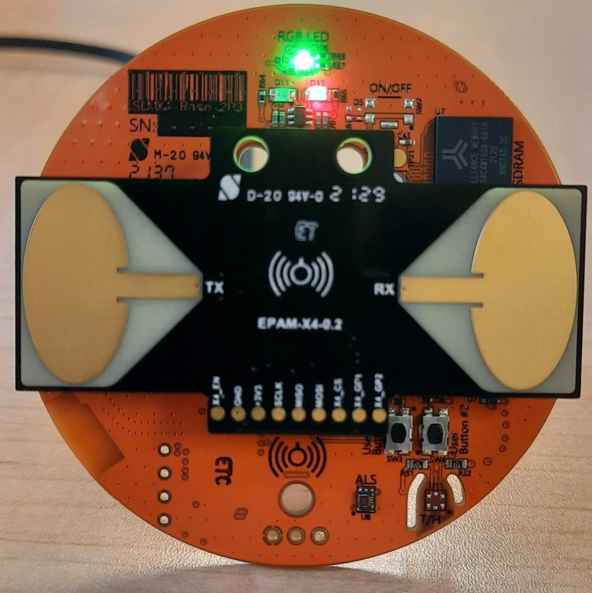

# Initial Unboxing and Setup Guide

## Unpacking and Powering On
When you first receive your SLMX4, carefully remove it from the EDS packaging.
Ensure the switch at the back is in this configuration:

WARNING: DO NOT CHANGE THIS CONFIGURATION WHILE THE MODULE IS POWERED ON
  
Plug in the SLMX4 using a micro-usb cable. With the SLMX4 plugged into your PC, click on the start menu and search for "device manager" and open it. Browse to "Ports (COM $ LPT)" and expand the menu. Ensure that the SLMX4 appears as "Virtual Com Port (COMX)" where "X" denotes the specific COM port for your machine.

If your module does not show up in the device manager in this manner, click [HERE](../usb_driver) and follow the instructions to manually install the correct driver.
If your module does show up correctly, the RGB LED will be a greenish-yellow color as shown:

## Flashing Firmware
The SLMX4 will come pre-loaded with the MATLAB firmware. To switch to the MATLAB or Health App firmware, refer to the [SLMX4 Firmware Update](../firmware/insecure_fw_update.md) user guide.

These are the latest files for both the Health App and MATLAB firmware:

- [SLMX4-Base Health Firmware](https://modules-release.s3-us-west-2.amazonaws.com/firmware/slmx4_base_usb_vcom_pb_dsp-epam0P1.s19)
- [SLMX4-Base MATLAB Firmware](https://modules-release.s3-us-west-2.amazonaws.com/firmware/slmx4_base_usb_vcom_xep_matlab_server.s19)
 
Here is the user guide for using the Health App. 

- [SLMX4 Health App User Guide](../firmware/health_app.md)

Here is the latest version of the Health App. Refer to the SLMX4 Health App user guide above to get started.

- [SLMX4 Health App](https://modules-release.s3-us-west-2.amazonaws.com/health_windows_app/slmx4_health_ui_usb.zip)

## The color of the LEDs
The health module comes equipped with an RGB LED as well as one green and one red LED.
The color of the RGB LED can help determine which firmware is present on the module.

- RGB: Green-yellow, Green: Off,         Red: Off             -> Denotes MATLAB firmware is loaded onto health module
- RGB: Teal,         Green: On (static), Red: On (static)     -> Denotes health module can be flashed with new/different firmware
- RGB: Off,          Green: Off,         Red: On (1 Hz blink) -> Health App firmware is loaded and not in operation
- RGB: Green,        Green: Off,         Red: On (1 Hz blink) -> Health App firmware is loaded and in operation, presence is not detected
- RGB: Violet,       Green: Off,         Red: On (1 Hz blink) -> Health App firmware is loaded and in operation, presence is detected

Picture Examples Respectively
1. 
	- 
2. 
	- 
3. 
	- 
4. 
	- 
5. 
	- 