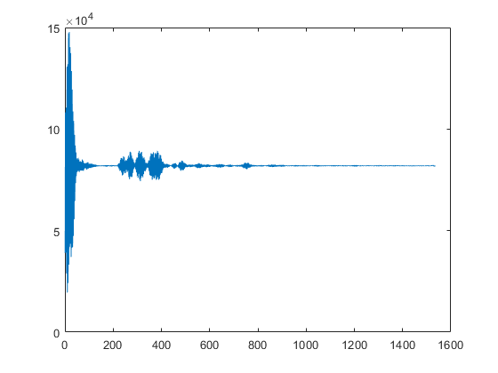

# XEP Matlab Connector Notes

The XEP Radar Connector is an interface which allows Matlab to interact with the
X4 UWB radar remotely.

- **vcom_xep_radar_connector**  
  This works on the HeMP2 hardware over USB; this NXP MIMXRT1062 micro-controller
  platform exposes USB as a virtual COM port. 

From the Matlab perspective, outside of the initial setup, the functionality of
the connectors should act identical between the two versions.

_In the current version, streaming radar data is not supported. Both connectors
support a design where the user will request (poll) for data, and the particular
server running will then produce a response message._

## vcom_xep_radar_connector

This version treats the USB interface as a virtual COM port.

On Windows, the device will show up in the 'Device Manager' under the 
'Ports (COM & LPT)' category, with the label 'Virtual Com Port'. _The driver 
should automatically install and have an manufacturer id of 'NXP'._


**Minimal example on capturing a single radar frame:**
```
r = vcom_xep_radar_connector('COM106');
r.Open('X4');

plot(r.GetFrameRawDouble);
r.Close();
```



## Variables

For compatibility with existing scripts, there are two ways to access 
variable names. Many of the older CamelCase variables are still present,
but there are now snake_case equivalents, along with some new ones unique
to the XEP driver.

| Old Name         | Updated Name      | Notes |
|:-----------------|:------------------|:------|
| DACMin           | dac_min           ||
| DACMax           | dac_max           ||
| DACStep          | dac_step          ||
| PPS              | pps               ||
| Iterations       | iterations        ||
| PRF              | prf_div           | fex4 PRF set is same as prf_div |
|                  | prf               ||
| SamplingRate     | fs                ||
| SamplersPerFrame | num_samples       ||
|                  | frame_length      ||
| RxWait           | rx_wait           ||
|                  | tx_region         ||
|                  | tx_power          ||
| DownConvert      | ddc_en            ||
|                  | frame_offset      ||
|                  | frame_start       ||
|                  | frame_end         ||
|                  | unambiguous_range ||
|                  | ur                | same as unambiguous_range |
|                  | sweep_time        ||

## Provide Scripts
### VCOM Test
There is an include script called `vcom_test.m`. This provides a simple plot window of Normalized Radar Data from the module.

### Unit Test
There is an included script called `unit_test.m`. This is a test of the get 
and set functions for adjustable radar settings.

It takes a minute or so to run. The output should look something like:
```
XEP set/get unit test
---------------------
dac_min test ok? 1
dac_max test ok? 1
dac_step test ok? 1
iterations test ok? 1
pps test ok? 1
prf_div test ok? 1
frame_length test ok? 1
rx_wait test ok? 1
tx_region test ok? 1
tx_power test ok? 1
ddc_en test ok? 1
```
