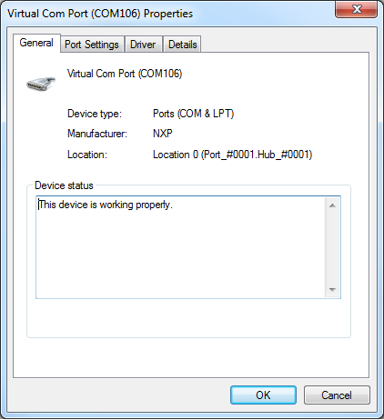
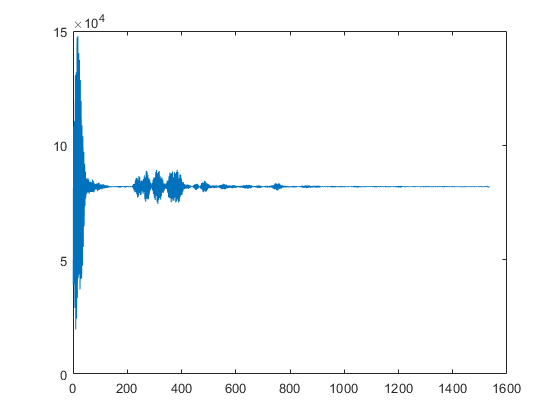
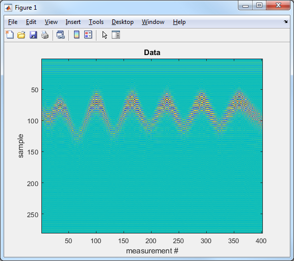

# XEP MATLAB Connector Notes

The XEP Radar Connector is an interface which allows [MATLAB](https://www.mathworks.com/products/matlab.html)
to interact with the X4 UWB radar remotely. From the Matlab perspective, outside of the initial setup, the 
functionality of this connector should act identical compared to the SensorLogic Linux XEP MATLAB Connector.

_In the current version, streaming radar data is not supported. The `vcom_xep_radar_connector` connector
supports a design where the user will request (poll) for data, and the particular server running will then 
produce a response message._

## Firmware Update
The SLMX4 Firmware can be updated using the [Insecure Firmware Update Guide](../firmware/insecure_fw_update.md).

## vcom_xep_radar_connector
The `vcom_xep_radar_connector` works on the SLMX4 hardware over USB; this NXP MIMXRT1062 micro-controller 
platform exposes USB as a virtual COM port. 

On Windows, the device will show up in the 'Device Manager' under the 'Ports (COM & LPT)' category, with the 
label 'Virtual Com Port'. _The driver should automatically install and have an manufacturer id of 'NXP'._

<p align="center">
  
</p>

**Minimal example on capturing a single radar frame:**
```
r = vcom_xep_radar_connector('COM106');
r.Open('X4');

plot(r.GetFrameRawDouble);
r.Close();
```
<p align="center">
  
</p>

## Variables

For compatibility with existing scripts, there are two ways to access variable names. Many of the older 
CamelCase variables are still present, but there are now snake_case equivalents, along with some new ones
unique to the XEP driver.

| Old Name         | Updated Name      | Description | Notes |
|:-----------------|:------------------|:------------|:------|
| DACMin           | dac_min           | minimum value of DAC sweep | always set >= 0 and < dac_max |
| DACMax           | dac_max           | maximum value of DAC sweep | always set <= 2047 and > dac_min |
| DACStep          | dac_step          | step size of DAC sweep | step size exponent, 2^n, n = (0,1,2,or 3) |
| PPS              | pps               | number of pulses integrated per DAC step ||
| Iterations       | iterations        | number of sweep iterations to perform ||
| PRF              | prf_div           | pulse repetition frequency in Hertz | * `fex4`'s PRF set is same as prf_div |
|                  | prf               | pulse repetition frequency in Hertz ||
| SamplingRate     | fs                | sampling rate in Hertz (23.328 GHz) ||
| SamplersPerFrame | num_samples       | number of samples per frame ||
|                  | frame_length      | frame length in steps of 96 sampling bins ||
| RxWait           | rx_wait           | sets delay for frame_offset ||
|                  | tx_region         | radar center frequency, Tx3 = 7.29 GHz, Tx4 = 8.748 GHz||
|                  | tx_power          | tx power level (0, 1, or 2) ||
| DownConvert      | ddc_en            | digital down conversion enable for IQ data||
|                  | frame_offset      | frame offset position in meters according to rx_wait||
|                  | frame_start       | frame start position in meters ||
|                  | frame_end         | frame end position in meters ||
|                  | unambiguous_range | unambiguous range in meters based on PRF ||
|                  | ur                | unambiguous range in meters based on PRF | same as unambiguous_range |
|                  | sweep_time        | calculated time need to a collect radar frame | varies based on sweep settings and PRF |

* `fex4` is legacy x4 driver not in current use

## Provided Scripts

### VCOM Test
There is an included script called `vcom_test.m`. This provides a simple plot window of normalized radar 
data from the module.

### Unit Test
There is an included script called `unit_test.m`. This is a test of the get and set functions for various 
adjustable radar settings.

It takes a minute or so to run. The output should look something like:
```
XEP set/get unit test
---------------------
dac_min test ok? 1
dac_max test ok? 1
dac_step test ok? 1
iterations test ok? 1
pps test ok? 1
prf_div test ok? 1
frame_length test ok? 1
rx_wait test ok? 1
tx_region test ok? 1
tx_power test ok? 1
ddc_en test ok? 1
```

### Timer Test
There is an included script called `timer_test.m`. This demonstrates how to use a Matlab timer to poll
the radar at a governed framerate.

When the script is run, radar data is collected for 10 seconds. After 10 seconds, the radar data is 
plotted where the x-axis represents the collection of radar frames, and the y-axis represents each radar
frame. Distance increases downward along the y-axis, and the color intensity represents signal amplitude.

In the example run, a metal plate was waved towards and away from the radar throughout.
<p align="center">
  
</p>