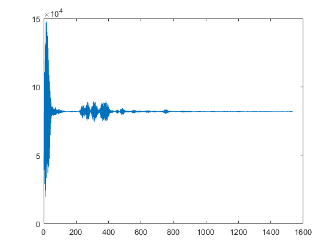

# XEP Matlab Connector Notes

The XEP Radar Connector is an interface which allows Matlab to interact with the
X4 UWB radar remotely. From the Matlab perspective, outside of the initial setup, the functionality of
this connector should act identical compared to the SensorLogic Linux XEP MATLAB Connector.

_In the current version, streaming radar data is not supported. The `vcom_xep_radar_connector` connector
supports a design where the user will request (poll) for data, and the particular
server running will then produce a response message._

## Firmware Update
The SLMX4 Firmware can be updated using the [Insecure Firmware Update Guide](https://github.com/SensorLogicInc/modules/blob/module-initial-release/docs/insecure_fw_update.md).

## vcom_xep_radar_connector
The `vcom_xep_radar_connector` works on the SLMX4 hardware over USB; this NXP MIMXRT1062 micro-controller platform exposes USB as a virtual COM port. 

On Windows, the device will show up in the 'Device Manager' under the 
'Ports (COM & LPT)' category, with the label 'Virtual Com Port'. _The driver 
should automatically install and have an manufacturer id of 'NXP'._


**Minimal example on capturing a single radar frame:**
```
r = vcom_xep_radar_connector('COM106');
r.Open('X4');

plot(r.GetFrameRawDouble);
r.Close();
```



## Variables

For compatibility with existing scripts, there are two ways to access 
variable names. Many of the older CamelCase variables are still present,
but there are now snake_case equivalents, along with some new ones unique
to the XEP driver.

| Old Name         | Updated Name      | Notes |
|:-----------------|:------------------|:------|
| DACMin           | dac_min           ||
| DACMax           | dac_max           ||
| DACStep          | dac_step          ||
| PPS              | pps               ||
| Iterations       | iterations        ||
| PRF              | prf_div           | fex4 PRF set is same as prf_div |
|                  | prf               ||
| SamplingRate     | fs                ||
| SamplersPerFrame | num_samples       ||
|                  | frame_length      ||
| RxWait           | rx_wait           ||
|                  | tx_region         ||
|                  | tx_power          ||
| DownConvert      | ddc_en            ||
|                  | frame_offset      ||
|                  | frame_start       ||
|                  | frame_end         ||
|                  | unambiguous_range ||
|                  | ur                | same as unambiguous_range |
|                  | sweep_time        ||

## Provide Scripts
### VCOM Test
There is an include script called `vcom_test.m`. This provides a simple plot window of Normalized Radar Data from the module.

### Unit Test
There is an included script called `unit_test.m`. This is a test of the get 
and set functions for adjustable radar settings.

It takes a minute or so to run. The output should look something like:
```
XEP set/get unit test
---------------------
dac_min test ok? 1
dac_max test ok? 1
dac_step test ok? 1
iterations test ok? 1
pps test ok? 1
prf_div test ok? 1
frame_length test ok? 1
rx_wait test ok? 1
tx_region test ok? 1
tx_power test ok? 1
ddc_en test ok? 1
```
