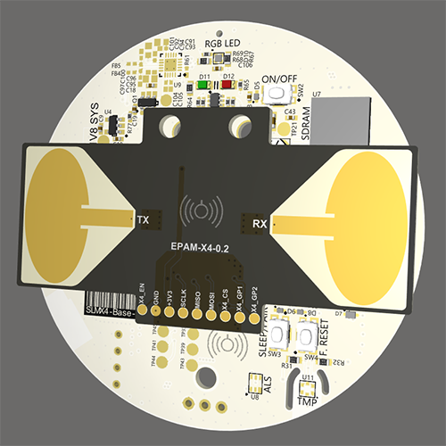

# X4 UWB Radar Modules
**S**ensor**L**ogic designs and develops the **M**odule base on the Xethru-**X4** UWB Radar.
## SLMX4 Hardware
The hardware platform is the modular 2-piece SLMX4, which is comprised of a baseboard (SLMX4-Base) and an elliptical patch antenna module (EPAM). The baseboard foundation is an [i.MX RT1060](https://www.nxp.com/products/processors-and-microcontrollers/arm-microcontrollers/i-mx-rt-crossover-mcus/i-mx-rt1060-crossover-mcu-with-arm-cortex-m7-core:i.MX-RT1060) crossover MCU from NXP. The hallmark sensor is the [X4 UWB radar](https://novelda.com/x4-soc.html) that can be used for myriad applications including occupancy, proximity, respiration, and embedded ML, out to 10 meters (RCS depending). Furthermore, large nonvolatile data storage is accessable via a micro SD card slot. Upon request, a custom platform can be configured by populating other environmental sensors on the PCB, and metrics such as room temperature, humidity, illiumance, and noise pressure levels could be recorded.   

<p align="center">
  
</p>

### SLMX4-Base
 - [SLMX4-Base Mechanical Drawing](https://modules-release.s3-us-west-2.amazonaws.com/hardware/slmx4-base/SLMX4-Base+2P1+PCB+Mechanical.PDF)
 - [SLMX4-Base Step File](https://modules-release.s3-us-west-2.amazonaws.com/hardware/slmx4-base/SLMX4-Base+2P1.step)
### EPAM 0P1
 - [SLMX4 EPAM Mechanical Drawing](https://modules-release.s3-us-west-2.amazonaws.com/hardware/epam-0p1/epam_0p1_mechanical_drawing.pdf)
 - [SLMX4 EPAM Step File](https://modules-release.s3-us-west-2.amazonaws.com/hardware/epam-0p1/Elliptical_Patch_Antenna_Module_Rev0.1.step)

## SLMX4 Health Firmware and App
The _Health Firmware_ runs our proprietary algorithms to identify the presence of, and distance to, a human target. If conditions are right, the human respiration is calculated within +/-1 RPM, out to 5 meters. The data is transmitted via USB or Wi-Fi and is displayed on a basic yet straightforward Windows Forms App, the [SLMX4 Health UI](firmware/health_app.md), ultimately displaying the subject's breathing pattern in real-time.

## SLMX4 MATLAB Firmware and Connector
The _[MATLAB Firmware and Connector](matlab/readme.md)_ allows the user to use an efficient, high-level development environment, like MATLAB, to query the module for raw radar data for custom algorithm and application development. The data comes in two flavors, real RF data, effectively sampled at 23.328 GSps, or In-Phase/Quadrature (IQ) data that has been downconverted and decimated. Complete control of the radar is available by being able to query and set every radar register parameter. For example, changing certain parameters will affect the frame rate versus processing gain, depending on the application and required SNR. 

## Folder Structure
```
├── firmware
│   ├── health_app.md                   # Documentation about the SLMX4 Health App
│   ├── insecure_fw_update.md           # Documentation about updating the SLMX4 Firmware
├── images                              # Contains the images used in the markdown files
├── matlab
│   ├── unit_test.m                     # MATLAB Script to verify the communication with the radar
│   ├── vcom_test.m                     # MATLAB Script to verify the ability to receive radar data
│   └── vcom_xep_radar_connector.m      # MATLAB Class to connect the Module to MATLAB
├── protocol_buffers
│   ├── slmx4_health.md                 # Health Firmware Protocol Buffer ReadMe
│   ├── slmx4_usb_vcom.options          # Health Firmware Protocol Buffer .options file
│   └── slmx4_usb_vcom.proto            # Health Firmware Protocol Buffer .proto file
├── usb_driver
│   ├── README.md                       # USB Driver ReadMe
│   └── inf/                            # Contains the USB VCOM device driver for Windows 

```
