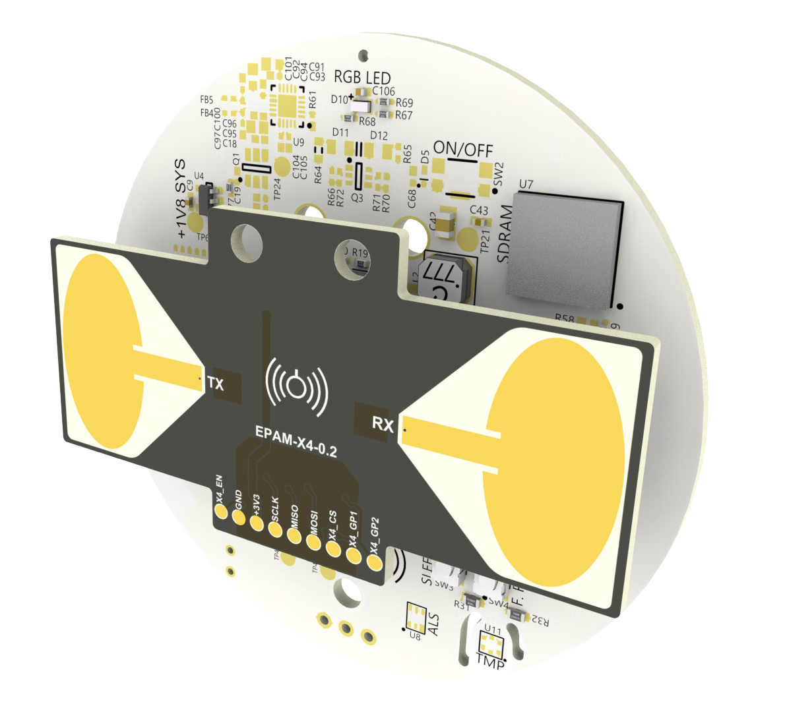

#### [Quick Start Guide](unboxing_quick_start) &nbsp;&nbsp;&nbsp;[SLMX4 Data Sheet](docs/SLMX4_Data_Sheet_2022.pdf) &nbsp;&nbsp;&nbsp;[X4 Radar Primer](docs/XTAN-13_XeThruX4RadarUserGuide_rev_a.pdf)

#### &nbsp;&nbsp;&nbsp;&nbsp;&nbsp;&nbsp;[Firmware](firmware) &nbsp;&nbsp;&nbsp;[XEP MATLAB Connector](matlab) &nbsp;&nbsp;&nbsp;[Health Python Wrapper](python) &nbsp;&nbsp;&nbsp;[USB Driver](usb_driver)

#### &nbsp;&nbsp;&nbsp;&nbsp;&nbsp;&nbsp;[SLMX4 Projects](slmx4_projects) &nbsp;&nbsp;&nbsp;[Code](https://github.com/SensorLogicInc/modules/tree/main/slmx4_projects) &nbsp;&nbsp;&nbsp;[Proto Buff Info](protocol_buffers)  

# Radar Modules

**S**ensor**L**ogic designs and develops **M**odules based on the Xethru-**X4** Ultra-wideband (UWB) Impulse Radar.

&nbsp; 

<p align="center">
  <a href="https://sensorlogicinc.github.io/modules/"></a>
</p>

&nbsp; 

## SLMX4 Hardware: Available for Purchase [HERE](https://sensorlogic.store/collections/uwb-radar-modules/products/slmx4-uwb-radar-module)
The hardware platform is the modular 2-piece SLMX4, which is comprised of a baseboard (SLMX4-Base) and an elliptical patch antenna module (EPAM). The baseboard foundation is an [i.MX RT1060](https://www.nxp.com/products/processors-and-microcontrollers/arm-microcontrollers/i-mx-rt-crossover-mcus/i-mx-rt1060-crossover-mcu-with-arm-cortex-m7-core:i.MX-RT1060) crossover MCU from NXP. The hallmark sensor is the [X4 UWB Radar](https://novelda.com/x4-soc.html) that can be used for myriad applications including occupancy, proximity, respiration, and embedded ML, out to 10 meters (RCS depending). Furthermore, large nonvolatile data storage is accessable via a micro SD card slot. Upon request, a custom platform can be configured by populating other environmental sensors on the PCB, and metrics such as room temperature, humidity, illiumance, and noise pressure levels could be recorded.   

<p align="center">
  <a href="https://sensorlogicinc.github.io/modules/"></a>
</p>

### Useful Files
 - [SLMX4 Data Sheet](docs/SLMX4_Data_Sheet_2022.pdf)
 - [SLMX4-Base + EPAM 0P1 Mechanical Drawing](https://modules-release.s3-us-west-2.amazonaws.com/hardware/SLMX4-Base+2P1+PCB+Mechanical.PDF)
 - [SLMX4-Base + EPAM 0P1 Step File](https://modules-release.s3-us-west-2.amazonaws.com/hardware/SLMX4-Base+2P1.step)
 - [SLMX4-Base + EPAM 0P2 Block Diagram](images/slmx4-base_epam0p2_system_architecture.png)
 - [X4 Radar Primer](docs/XTAN-13_XeThruX4RadarUserGuide_rev_a.pdf)

## SLMX4 Health Firmware and App
The [Health Firmware](https://modules-release.s3-us-west-2.amazonaws.com/firmware/slmx4_base_usb_vcom_pb_dsp-epam0P1.s19) runs our proprietary algorithms to identify the presence of, and distance to, a human target. If conditions are right, the human respiration is calculated within +/-1 RPM, out to 5 meters. The data is transmitted via USB or Wi-Fi and is displayed on a basic yet straightforward Windows GUI App, the [SLMX4 Health UI](firmware/health_app.md), ultimately displaying the subject's breathing pattern in real-time. Furthermore, there is a [Python Wrapper and Demos](python) that interface with the _Health Firmware_ to enable rapid, embedded integration.

## SLMX4 MATLAB Firmware and Connector
The _[MATLAB Firmware and Connector](matlab/readme.md)_ allows the user to use an efficient, high-level development environment, like MATLAB, to query the module for raw radar data for custom algorithm and application development. The data comes in two flavors, real RF data, effectively sampled at 23.328 GSps, or In-Phase/Quadrature (IQ) data that has been downconverted and decimated. Complete control of the radar is available by being able to query and set every radar register parameter. For example, changing certain parameters will affect the frame rate versus processing gain, depending on the application and required SNR. 

## Folder Structure
```
├── firmware
│   ├── health_app.md                       # Documentation about the SLMX4 Health App
│   └── insecure_fw_update.md               # Documentation about updating the SLMX4 Firmware
├── images                                  # Contains the images used in the markdown files
├── matlab
│   ├── timer_test.m                        # MATLAB Script to demo fixed radar framerate
│   ├── unit_test.m                         # MATLAB Script to verify the communication with the radar
│   ├── vcom_test.m                         # MATLAB Script to verify the ability to receive radar data
│   └── vcom_xep_radar_connector.m          # MATLAB Class to connect the Module to MATLAB
├── protocol_buffers
│   ├── slmx4_health.md                     # Health Firmware Protocol Buffer Details
│   ├── slmx4_usb_vcom.options              # Health Firmware Protocol Buffer .options file
│   └── slmx4_usb_vcom.proto                # Health Firmware Protocol Buffer .proto file
├── python
│   ├── slmx4_health_wrapper.py             # Python wrapper for Health Firmware
│   ├── slmx4_usb_vcom_pb2.py               # Python protobuf spec for Health
│   ├── slmx4_health_polling_demo.py        # Python Script to demo Health polling
│   ├── slmx4_health_streaming_demo.py      # Python Script to demo Health streaming
│   └── slmx4_health_streaming_plot_demo.py # Python Script to demo Health streaming and breathing pattern plotting
├── slmx4_projects
│   └── vcom_xep_matlab_server              # MATLAB XEP server firmware for the SLMX4
└── unboxing_quick_start
    └── readme.md                           # SLMX4 Unboxing quick start guide
└── usb_driver
    └── inf/                                # Contains the USB VCOM device driver for Windows 
```

**[Home](https://www.sensorlogic.ai/)**
