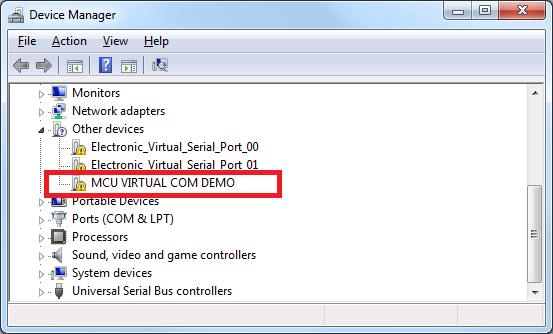
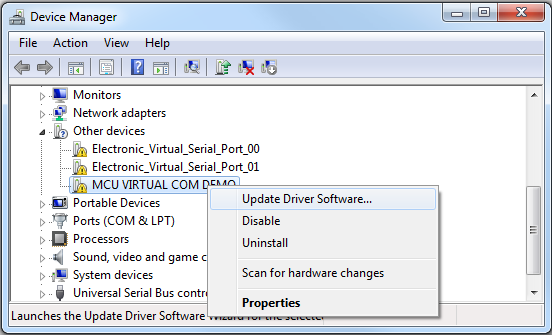
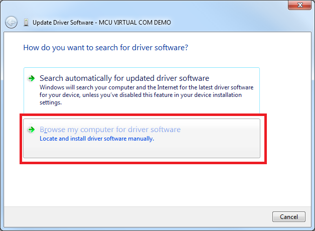
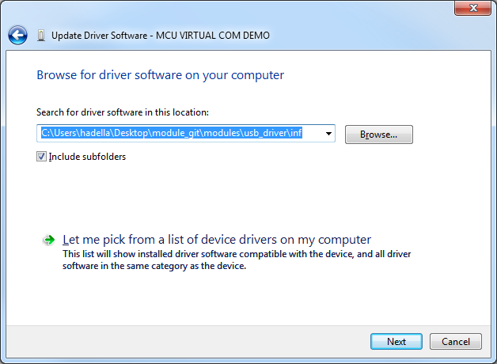
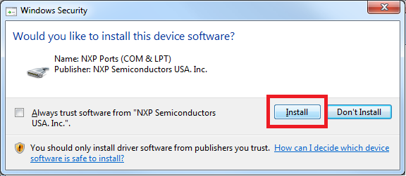
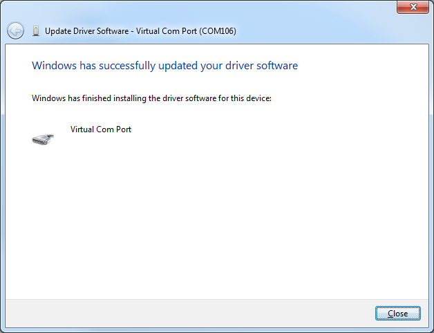
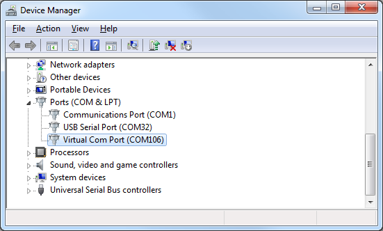
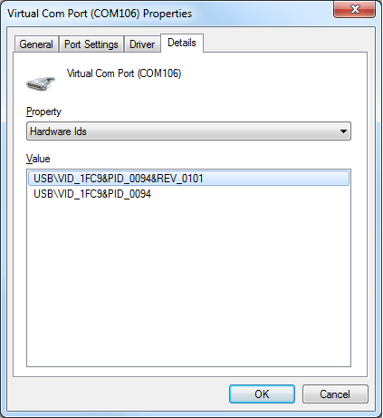

# USB Driver Install
This guide contains steps needed to install the USB driver when Windows doesn't
automatically install it.

Open the Windows Device Manager. The SLMX4 will display as **MCU VIRTUAL COM DEMO**.

Right-click and select 'Update Driver Software...'.

When the new window opens, select the bottom button 'Browse my computer...'.

Browse for the location of the `usb_driver/inf` folder. In this case, this shows
the indicated folder where I had checked out the github repository.

During the installation there will be a Windows Security window.

After some time, the driver should install successfully.

When we hit 'Close' our SLMX4 device will now show up under the **Ports** 
category. In this case, it's COM106 on this test PC.

In this last image, the USB VID and PID are shown. This could be added to any
user app to distinguish the SLMX4 from other virtual COM devices.

